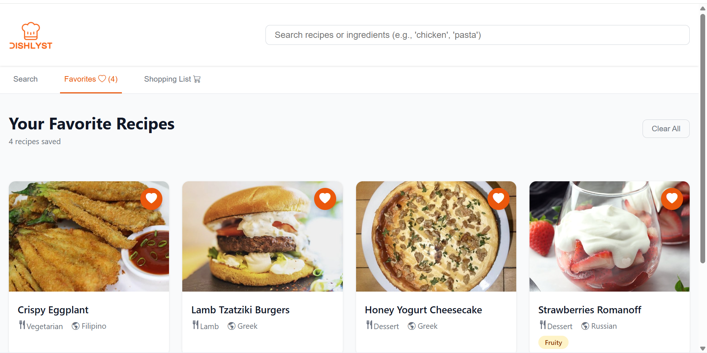
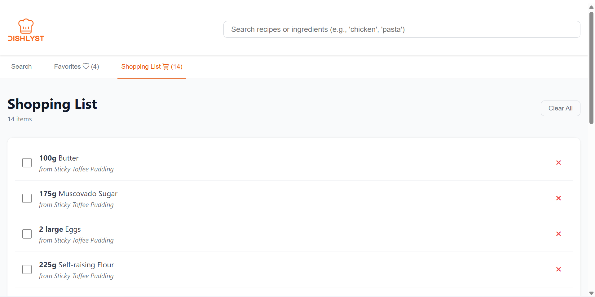

## Dishlyst – Recipe Finder & Meal Planner

Dishlyst is a modern web app that lets users discover, save, and organize recipes. You can search by ingredients, cuisine, or category, then save your favorite meals and automatically build a shopping list all in one place.

## Demo

### Screenshots

#### Search Recipes
Find dishes easily by typing keywords or ingredients.


#### Save Favorites
Bookmark your favorite meals to access them later.



#### Save Shopping List
Add recipe ingredients directly to your personal shopping list.




### Live Demo

[View Live Demo](https://jericho066.github.io/dishlyst/)

## Features
- Search recipes by name or ingredients
- Filter by category (e.g., Chicken, Dessert) or cuisine (e.g., Italian, Japanese)
- Save favorites locally with persistent storage
- Generate a shopping list directly from recipe ingredients
- Responsive design that works on desktop and mobile
- Offline-friendly (data saved with localStorage)
- Clean, accessible, modern UI with Bootstrap Icons

## Tech Stack
- Frontend: React (Vite)
- Styling: Custom CSS (with Bootstrap Icons)
- API: TheMealDB API
- Storage: Browser localStorage
- Deployment: GitHub Pages

## Setup & Installation

### 1. Clone the  repository
```bash
git clone https://github.com/jericho066/dishlyst.git
cd dishlyst
```

### 2. Install dependencies
```bash
npm install
```

### 3. Run the app locally
```bash
npm run dev
```

### 4. Open in browser:
```bash
http://localhost:5173/
```


## API Reference
All recipe data is fetched from [TheMealDB API](https://www.themealdb.com/api.php).

**Endpoints used include:**
- search.php?s=
- filter.php?c=
- filter.php?a=
- lookup.php?i=
- random.php

